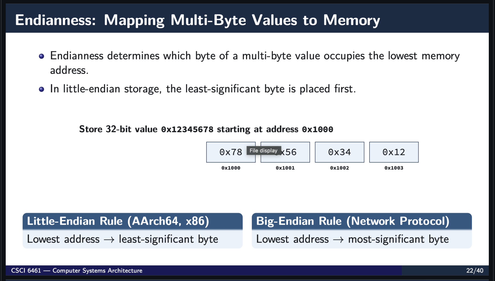

# Introduction and Pre Knowledge

In fact, Endianness (big/little endian) is one of the essential topics in practical and theorytical CS. Recently, it is also discussed in course Computer Systems and Architecture taught by Dr. John Thomas Burns. Here is the quick overview what is mentioned:

Source: <https://github.com/jzburns/csci-comp-arch/blob/master/latex/csci-6461/csci-6461-1.pdf>

## What is Endianness?

Endianness is the order in which a computer stores the bytes of a number in memory. A number bigger than one byte, such as a 4 byte integer, must be split into pieces, and the computer has to decide which piece goes first.

There are two main orders:

- **Big-endian:** the most significant byte (the "big end") is stored first, at the lowest memory address. This is the same way we write numbers on paper, left to right.
- **Little-endian:** the least significant byte (the "little end") is stored first. The number looks reversed in memory.

Example: the hexadecimal number `0x12345678` stored at memory addresses 0 to 3.

| Address | 0 | 1 | 2 | 3 |
|---|---|---|---|---|
| Big-endian | `12` | `34` | `56` | `78` |
| Little-endian | `78` | `56` | `34` | `12` |

The value is the same in both case, and only the order of the bytes changes. The names come from *Gulliver's Travels*, where two groups fight over which end of an egg should be broken first.

Source: <https://www.ling.upenn.edu/courses/Spring_2003/ling538/Lecnotes/ADfn1.htm>