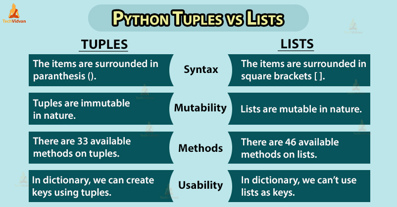

# Introduction and Initial Knowledge

Before running the code, I analyzed its structure and behavior.

## List and Tuples

We begin with a tuple and a list, both containing the same three integer elements:

- **Tuple:** `tpl = (1, 2, 3)`
- **List:** `lst = [1, 2, 3]`

In Python, **mutability** is a key foundational concept:

- **Tuples** are **immutable**.
- **Lists** are **mutable** and act as **dynamic arrays**, allowing for runtime modifications such as insertions and deletions.

I always prefer this image while comparing them:



Source Link: <https://techvidvan.com/tutorials/python-tuples-vs-lists/>

## Sizeof operator

Regarding `__sizeof__()`, it is used to measure the memory size of an object. For our example, we can test whether a list or tuple is more memory efficient for a string values, and `__sizeof__()` reveals their baseline sizes.

# Experiments

When I firstly run code, I get these results:

```python
tpl = (1,2,3)
__sizeof__()
lst = [1,2,3]
__sizeof__()
```

```text
NameError: name '__sizeof__' is not defined
```

Then I fixed some parts, I have run code again:

```python
tpl = (1, 2, 3)
print(tpl.__sizeof__())
lst = [1, 2, 3]
print(lst.__sizeof__())
```

```text
48
72
```

Then I wondered and experimented this code:

```python
tpl = ()
print(tpl.__sizeof__())
lst = []
print(lst.__sizeof__())
```

```text
24
40
```

Then I appended elements observed size growth

```python
tpl = (1, 2, 3, 4)
print(tpl.__sizeof__())
lst = [1, 2, 3, 4]
print(lst.__sizeof__())
```

```text
56
72
```

```python
tpl = (1, 2, 3, 4, 5)
print(tpl.__sizeof__())
lst = [1, 2, 3, 4, 5]
print(lst.__sizeof__())
```

```text
64
88
```

| n | Tuple `__sizeof__()` (bytes) | List `__sizeof__()` (bytes) |
|---|---|---|
| 1 | 32 | 48 |
| 2 | 40 | 56 |
| 3 | 48 | 72 |
| 4 | 56 | 72 |
| 5 | 64 | 88 |


Size by element count shows the tuple grows in exact 8-byte steps, while the list grows in jumps


## Why the Sizes Grow This Way
I checked python documentation and found these interesting facts that can be potential reasons

**Tuples are fixed.** The Python documentation states: *"Tuples are immutable sequences"* ([Built-in Types](https://docs.python.org/3.12/library/stdtypes.html#tuples)). A tuple never changes length, so it stores exactly `n` pointers (8 bytes each) after a 24-byte header:

**Tuple size = 24 + 8 × n**

**Lists reserve extra space.** A list keeps its elements in a separate array. Its header therefore holds two more fields: a pointer to that array and its capacity, which makes the header 40 bytes. According to the documentation, when the array grows, *"some extra space is allocated so the next few times don't require an actual resize"* ([Design and History FAQ](https://docs.python.org/3.12/faq/design.html#how-are-lists-implemented-in-cpython)):

**List size = 40 + 8 × capacity**

| n | Tuple (bytes) | List capacity | List (bytes) |
|---|---|---|---|
| 1 | 32 | 1 | 48 |
| 2 | 40 | 2 | 56 |
| 3 | 48 | 4 | 72 |
| 4 | 56 | 4 | 72 |
| 5 | 64 | 6 | 88 |

# Conclusion

The tuple (1,2,3) takes 48 bytes and the list [1,2,3] takes 72 bytes. The tuple is smaller because it cannot change, so Python stores exactly 3 elements and nothing more. The list is bigger because it can grow, so Python adds extra header fields and keeps one spare slot ready for the next element.